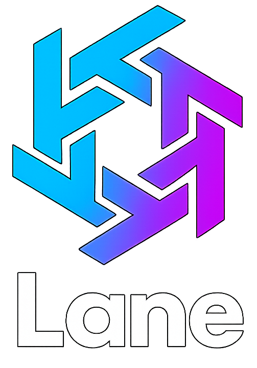

  

# Relatorio Lane - Competências Comunicacionais - Grupo 08  

 

---

## 1. Motivo da Escolha do Tema  

Escolhemos este tema por ser uma area onde existe um claro problema, a descoberta de eventos encontra-se dispersa entre diferentes plataformas, isto cria uma difuldade na organização, tanto de um evento como de alguem à procura, a **Lane** visa resolver isso criando uma plataforma unica com apenas esse objetivo. 

---

## 2. Solução Desenvolvida  

A **Lane** é uma aplicação de localização de eventos, o problema denotado no ponto anterior mostra uma clara necessidade de unificar a descoberta de eventos, e é isso mesmo que a **Lane** faz, sendo uma plataforma unica e exclusivamente focada na criação e partilha de eventos, sejam eles concertos, manifestações, eventos culturais ou até mesmo uma pequena sessão de estudo ao ar livre.

---

## 3. Contribuições  

Pedro António: Desenvolvimento total da Base de Dados. Desenvolvimento total da aplicação mobile (Android Studio). Criação de documentação e apresentações. Desenvolvimento de logos e marca da aplicação. Auxilio no desenvolvimento do Backend
Filomeno Sabino: Desenvolvimento total do Backend da aplicação.
Francisco Abecasis: Desenvolvimento do conteudo dos documentos (texto, graficos, personas, etc...)
Savio Casimira: Criação do video promocional
Gianni Lopes: Criação do poster final

---

## 4. Enquadramento da UC (Competências Comunicacionais)
Esta UC foi ajudou-nos bastante em todos os aspectos de documentação e apresentação relacionados com o projeto. Com Apresentações, Relatorios, Videos e Posters

---

## 5. Conclusões individuais

Pedro António:  
Acho que o projeto terminou num estado funcional, a aplicação faz o que era pretendido, embora não da melhor maneira, o desenvolvimento deste projeto teve varios problemas, principalmente de organização de grupo, mas mesmo assim acho que consegui no espaço de tempo que me foi dado, juntamente com os meus colegas que algo fizeram, desenvolver uma aplicação/projeto funcional e que carrega uma idea de negocio forte.
Numa nota mais pessoal, estou contente com o meu proprio desenvolvimento, comecei o projeto um pouco mais tarde por não ter grupo inicialmente, sinto que consegui "agarrar" o projeto, visto que certos elementos pouco ou nada fizeram (Sem qualquer aviso), e desenvolver não so um projeto que me permite passar à cadeira mas tambem desenvolver as minhas capacidades e conhecimentos de programação e principalmente a minha organização pessoal e vontate de trabalho.  

Filomeno Sabino:
